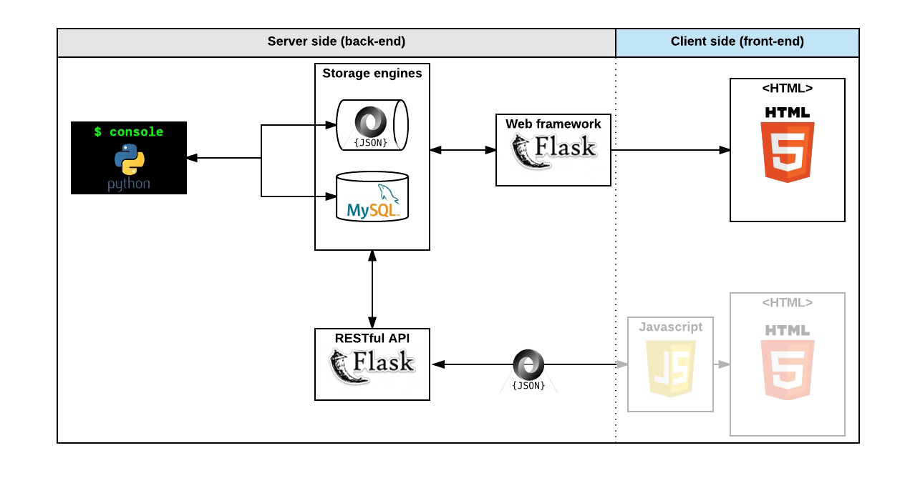

# AirBnB clone

This project has for goal to create a simple copy of the [AirBnB website](https://www.airbnb.com/).
It will not have all the features, only some of them to cover all fundamental concepts of the higher level programming track.

This project will take four months and six steps. We are currently working on: __the Console__

## 1st step - The Console

- create your data model
- manage (create, update, destroy, etc) objects via a console / command interpreter
- store and persist objects to a file (JSON file)

The first piece is to manipulate a powerful storage system. This storage engine will give us an abstraction between “My object” and “How they are stored and persisted”. This means: from your console code (the command interpreter itself) and from the front-end and RestAPI you will build later, you won’t have to pay attention (take care) of how your objects are stored.

This abstraction will also allow you to change the type of storage easily without updating all of your codebase.

The console will be a tool to validate this storage engine

### Learning Objectives:
    - Serialization / Deserialization flow (object <-> Dict <-> Json <-> file)
    - Packages / Modules / Cyclical imports / How to import / Prevent execution /Etc.
    - Layered architecture
    - Interfaces (storage)
    - Abstract Classes (BaseClass)

### How to start it:
### How to use it:
### Examples:
## 2nd step - Web static

- learn HTML/CSS
- create the HTML of your application
- create template of each object

## 3rd step - MySQL storage

- replace the file storage by a Database storage
- map your models to a table in database by using an O.R.M.

## 4th step - Web framework - templating

- create your first web server in Python
- make your static HTML file dynamic by using objects stored in a file or database

## 5th step - RESTful API

- expose all your objects stored via a JSON web interface
- manipulate your objects via a RESTful API

## 6th & last step - Web dynamic

- learn JQuery
- load objects from the client side by using your own RESTful API

## Authors:
Antoine Jacob <[AntoineJacob](https://github.com/AntoineJacob)>
& Maxence Thibault <[mxnctblt](https://github.com/mxnctblt)>